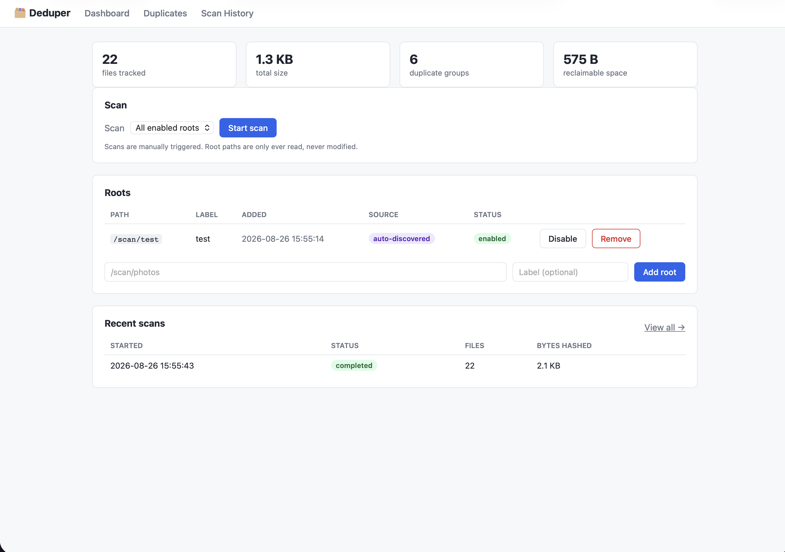
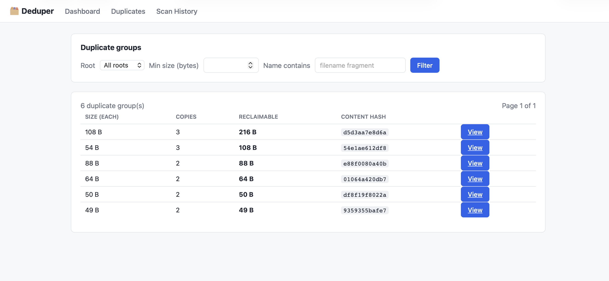
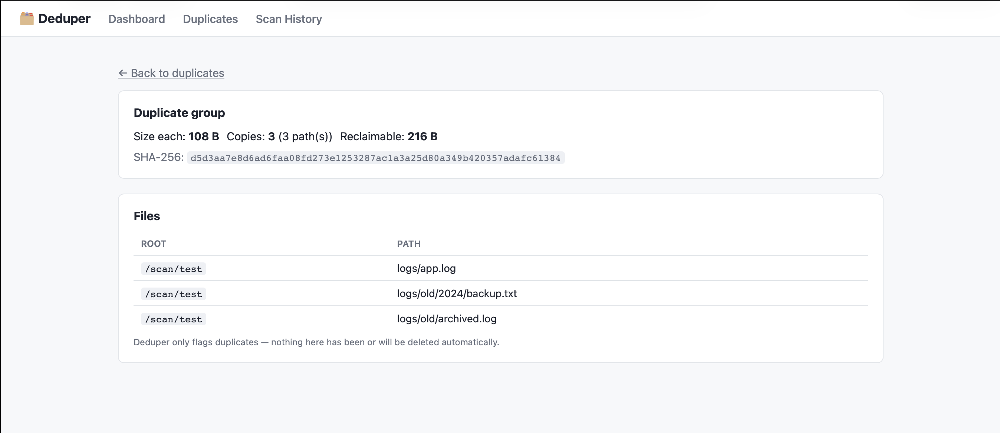
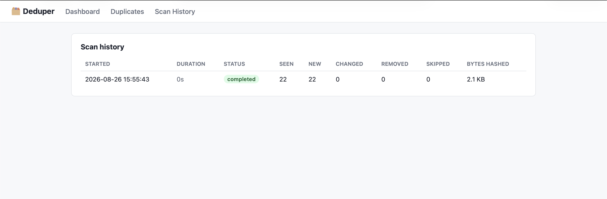

# deduper

Self-hosted, containerized web app, written in Go, that scans one or more
filesystem paths, finds files that are byte-for-byte identical, and reports
how much space could be reclaimed by removing the redundant copies.

It never modifies or deletes files. Its job ends at detection and reporting;
the user acts on the results themselves, outside the tool, in their own file
manager or shell.

## Run it

```sh
git clone https://github.com/mophead64/deduper.git
cd deduper
```

With Docker Compose:

```sh
docker compose up --build
```

With plain `docker run` (equivalent to the compose file below, spelled out
explicitly):

```sh
docker build -t deduper .
docker run -d \
  --name deduper \
  -p 8080:8080 \
  -v deduper-data:/data \
  -v /mnt/photos:/scan/photos:ro \
  -v /mnt/backups:/scan/backups:ro \
  deduper
```

Then open http://localhost:8080. Any directory bind-mounted under `/scan/`
is picked up automatically as a root on startup (see "Root auto-discovery"
below) — no manual step needed before clicking "Start scan".

Without Docker:

```sh
go run ./cmd/deduper
```

By default this uses `/data/deduper.db`; override with `DEDUPER_DB=./data/deduper.db`
and `PORT=8080` as needed.

## Try it on the bundled test fixture

[`test/`](test/) is a small tree of sample files checked into this repo for
trying the app out without pointing it at real data. It's nested a few
levels deep, uses a mix of extensions (`.txt`, `.log`, `.csv`, `.yaml`/`.yml`,
`.jpg`/`.jpeg`, `.png`, `.gif`, `.ini`, `.bak`, `.dat`, ...) to demonstrate
that duplicate detection is based on content, not filename or extension, and
includes:

- several duplicate groups of 2–3 copies each, spread across different
  subfolders and extensions
- genuinely unique files with no duplicates
- two empty (0-byte) files, which the app excludes from duplicate detection
  (see "Duplicate detection algorithm" below, Stage 1)

To use it: add `./test` (or its absolute path) as a root and scan, or mount
it at `/scan/test` for auto-discovery (already wired up in
[docker-compose.yml](docker-compose.yml)).

## Using the app

The screenshots below are from a scan of that test fixture, so the numbers
match what you'll see if you follow along.

**Dashboard.** This is home base: headline stats across everything tracked so
far, a control to kick off a scan (all enabled roots, or just one), the list
of roots with their auto-discovered/manual badge and enable/disable/remove
controls, and a quick look at recent scans. Everything here updates live via
SSE while a scan is running.



**Duplicates.** The full list of duplicate groups, sorted by how much space
each would free up if you deleted all but one copy. Filter by root, minimum
size, or a filename fragment if the list gets long.



**A duplicate group.** Clicking into a group shows the SHA-256 that ties its
members together and every path holding a copy, so you can go and deal with
them yourself — deduper never deletes anything for you.



**Scan history.** Every scan that's ever run, with its duration and a
breakdown of new/changed/removed/skipped files — useful for confirming an
incremental rescan actually skipped the work it should have.



## Docker mounts

- `/data` — read-write volume for the SQLite database.
- `/scan/<name>` — one read-only bind mount per path you want to scan. Each
  is auto-registered as an enabled root, labeled with the directory name, the
  next time the container starts (see below). You can still add, remove, or
  disable roots by hand from the UI — auto-discovery only ever adds paths
  under `/scan/` that aren't already known; it never removes or overrides
  anything.

### Root auto-discovery

On startup, the app lists the immediate subdirectories of `/scan` (override
with `DEDUPER_SCAN_BASE`) and registers any that aren't already a known root.
So the workflow for a new path is: add a bind mount under `/scan/<name>` in
`docker-compose.yml` (or a `-v .../scan/<name>:ro` flag with `docker run`),
restart the container, and it shows up on the dashboard already added and
enabled — scan it whenever you're ready. `/scan` not existing (e.g. running
outside Docker) is not an error; there's just nothing to discover.

## Architecture

Single Go binary containing:

- **Scanner/hasher engine** — walks roots, maintains file metadata, computes
  hashes, emits progress events.
- **SQLite store** — durable metadata: roots, files, scans, duplicate groups.
- **Web server** — serves the UI and a small JSON/SSE API from the same
  binary.

The UI is server-rendered HTML (Go `html/template`) with
[htmx](https://htmx.org/) for interactivity, and **Server-Sent Events (SSE)**
push live scan progress to the browser. There's no separate frontend build
pipeline and the container is a single process. A scan runs server-side
regardless of whether a browser is attached; the UI just observes it.

```
  Browser (htmx + SSE)
        |
        v
  +--------------------------------+
  |           Go binary            |
  |                                |
  |   HTTP server <---> Scanner    |
  |                        |       |
  |                        v       |
  |                     SQLite     |
  +--------------------------------+
        |                 |
     /data              /scan/*
   (volume)      (bind mounts, read-only)
```

## Data model (SQLite)

WAL mode is enabled for concurrent reads during a running scan. Everything
lives in one SQLite file, across five tables:

- **roots** — one row per scanned path: its container path, an optional
  label, when it was added, whether it's enabled, and whether it was added by
  hand or discovered automatically under `/scan` (see "Root auto-discovery").
- **scans** — one row per scan run: status (`running` / `completed` /
  `failed` / `interrupted`), current phase, and live counters (files
  seen/new/changed/removed/skipped, bytes hashed).
- **scan_roots** — a join table recording which roots each scan covered.
- **files** — one row per file ever seen: its root, relative path, size,
  mtime, device/inode (used for hardlink detection), its partial and full
  hashes, and whether it's still `present` or has gone `missing`. Indexed on
  size, `(size, partial_hash)`, `(size, full_hash)`, and `(device, inode)` —
  the four lookups the detection pipeline needs.
- **duplicate_groups** / **duplicate_group_members** — a materialized view of
  the current duplicate groups (size, hash, member count, distinct on-disk
  instance count, reclaimable bytes), rebuilt after every scan and after any
  root deletion.

Deleting a root deletes its files and their duplicate-group memberships in
the same transaction (a plain delete would otherwise be rejected with a
foreign key violation, since files reference their root), then rebuilds
`duplicate_groups` from what remains.

## Duplicate detection algorithm

Detection is a staged pipeline: the most expensive step (reading full file
content) only runs on files that survive every cheaper filter first.

**Stage 0 — Walk & stat.** For each enabled root, the app walks the tree. For
every regular file, it `stat`s it and upserts a `files` row with size, mtime,
device, and inode. Files present in the DB from a prior scan of this root but
not seen this walk are marked `missing`. This stage never reads file content.

**Stage 1 — Size filter.** Seen files are grouped by `size`. A file whose
size is unique across the whole dataset cannot be a duplicate of anything and
is never hashed — this alone eliminates most files in a typical tree. Files
of size 0 are excluded entirely at this stage: reclaiming zero bytes isn't
meaningful, and every empty file trivially "matches" every other one.

**Stage 2 — Partial hash.** For files in a size group with 2+ members, the
app computes a fast, non-cryptographic hash (xxh3) over a sample of the
content — the first 64 KiB, plus a chunk from the middle and the last 64 KiB
for files larger than a few MB (this guards against files that share an
identical header/footer but differ in the middle, e.g. many video
containers). This is the cheap "probably a duplicate" filter.

**Stage 3 — Partial-hash filter.** Files are grouped by `(size,
partial_hash)`. Singleton groups are dropped — they were false positives from
the sample and don't need to be read further.

**Stage 4 — Full hash.** Files still grouped after Stage 3 are streamed
through SHA-256 in full. This is the only step that reads a whole file
end-to-end, and it only ever runs on genuine candidates.

**Stage 5 — Group and collapse hardlinks.** Files are grouped by `(size,
full_hash)`. Within a group, files sharing the same `(device, inode)` are
hardlinks to the same on-disk data and are listed as one logical instance.
`distinct_instance_count` counts distinct `(device, inode)` pairs, not raw
file paths, and `reclaimable_bytes` is `(distinct_instance_count - 1) *
size`. Hardlinked members are shown in the UI as "already linked, no space to
reclaim" rather than as actionable duplicates.

Filenames play no part in any of this: two files are duplicates purely on the
basis of verified identical content (size + full hash). A matching filename
is surfaced in the UI, when present, only as a hint that might help decide
which copy to keep — it never changes how a group is classified.

### Incremental rescans

On a rescan of a root already in the database, the walk loads that root's
known files once and classifies each entry in memory. A file whose `(size,
mtime_ns, device, inode)` is unchanged since it was last seen skips Stages 2
and 4 entirely — its stored `partial_hash`/`full_hash` is reused as-is — and
costs **no database write at all**. Only new, changed, and now-missing files
are written (missing is computed as a local set difference, not a table
scan), which is what makes repeat scans of large, mostly-static trees fast.

This trusts mtime as a proxy for "content unchanged": a file rewritten with
its original content and a manually preserved mtime would be missed. That's
an accepted trade-off — the same one `rsync`, `make`, and similar tools make.

## Scanning behavior & edge cases

- **Concurrency:** the walk fans directory reads out across a bounded pool
  (`DEDUPER_WALK_WORKERS`, default ~2× CPU) and streams the results into one
  batching DB writer; hashing uses its own bounded pool (`DEDUPER_HASH_WORKERS`,
  default ~1× CPU). All database writes go through a single-writer connection in
  batched transactions, while reads (the UI) use a separate concurrent pool so
  they don't queue behind a running scan. `DEDUPER_MEMORY_LIMIT_MIB` sets a soft
  heap ceiling (as does the standard `GOMEMLIMIT`).
- **Streaming:** files are hashed via `io.Copy` into the hash function, never
  loaded fully into memory, regardless of size.
- **Symlinks:** not followed. Recorded as seen but excluded from hashing and
  duplicate detection.
- **Special files** (sockets, devices, FIFOs): skipped, counted in
  `scans.files_skipped`.
- **Permission errors:** logged per-file, the scan continues, and the count
  is surfaced in the scan summary rather than aborting the whole scan.
- **Files that vanish mid-scan** (race with concurrent external changes):
  treated as a skip/error for that file, not a scan failure.
- **Interrupted scans** (container stopped mid-run): the `scans` row is left
  in `running` status; on next startup any `running` scan is marked
  `interrupted`. Files already committed to the DB during the scan remain
  valid — writes happen in small batched transactions, not one giant
  transaction, so a partial scan leaves correct partial data rather than
  corrupt data.
- **Cross-root duplicates:** detection is global — a file in one root can be
  flagged as a duplicate of a file in a different root.

## Real-time progress

While a scan runs, the engine emits progress events consumed via SSE
(`GET /scans/{id}/events`):

- `scan_started` — roots involved.
- `progress` — roughly once a second: current phase, files processed/skipped,
  bytes hashed, current path, elapsed time.
- `scan_completed` / `scan_failed` — terminal event; the dashboard reloads to
  show the finished state.

Only the browser tab actually viewing a running scan's panel holds an SSE
connection; other open tabs (or the duplicates/scan-history pages) don't
live-update and need a manual reload to see a scan's result.

## Web UI

- **Dashboard** — roots (add/enable/disable/remove), each tagged
  "auto-discovered" or "manual" so it's clear at a glance which ones came
  from a `/scan` bind mount versus being typed in; "Start scan" (all enabled
  roots or a specific one); live status of any in-progress scan; headline
  stats: total files tracked, total bytes tracked, total reclaimable space.
- **Duplicates browser** — duplicate groups sorted by `reclaimable_bytes`
  descending by default; filter by root, minimum size, path/name substring;
  each group expands to show member paths, size, mtime, and a "hardlinked"
  badge where applicable. "Rescan this group" re-checks just that group's
  files on disk (no scan record is created): deleted files leave the group,
  changed files are re-hashed and stay only if they still match, and the group
  disappears once fewer than two copies remain. Use it while cleaning up.
- **Scan history** — past scans with their summary stats and status.

## Non-functional notes

- Scale target: low millions of files, multi-TB total size, on a single
  SQLite database with the indexes above.
- No full-file reads beyond what Stage 4 requires.
- Strictly read-only against scanned paths — the app never issues a
  write/delete syscall against them, and `:ro` bind mounts enforce that at
  the Docker level too.
- Single static Go binary; distroless, non-root final image.

## Tech stack

- Go, standard library `net/http` + `html/template`, htmx for interactivity.
- SQLite via a pure-Go driver (`modernc.org/sqlite`) to keep cross-compilation
  and the container image simple (no cgo).
- `zeebo/xxh3` for the Stage 2 partial-hash filter.
- `crypto/sha256` (stdlib) for the Stage 4 confirmation hash.

## What this doesn't do

- Delete, move, or quarantine files — flagging only, by design. The tool
  flags, the human decides.
- Fuzzy/near-duplicate or perceptual matching (e.g. re-encoded media,
  visually similar images) — exact content matches only.
- Auth or multi-user support — run it on a trusted host/network; put a
  reverse proxy in front if you need auth.
- Scheduled/automatic scanning — scans are always user-triggered.
- Following symlinks.

## License

[MIT](LICENSE)
